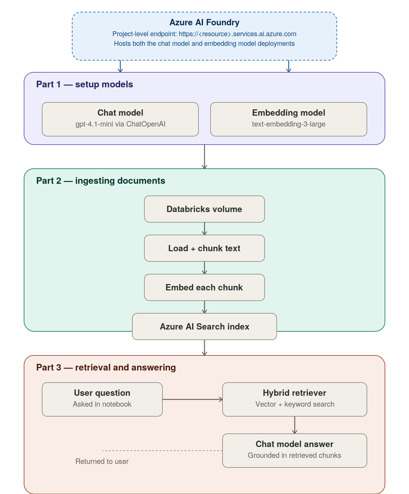

# Azure Docs RAG Chatbot

A Retrieval-Augmented Generation (RAG) chatbot built on Databricks that answers questions over Azure Data Engineering documentation (Azure Data Factory, with the pipeline designed to extend to Microsoft Fabric and Databricks docs as well). The chatbot retrieves relevant passages from indexed documentation and uses an LLM to generate grounded answers, citing the source file and page.

Built as a student project using Azure's free-tier services, LangChain, and Databricks notebooks.

## Architecture



The project is organized into three parts, described in detail below:

1. **Setup models** — connect to the chat model and embedding model
2. **Ingesting documents** — load, chunk, embed, and index source documentation
3. **Retrieval** — answer user questions using hybrid search + the chat model

## Tech stack

| Component | Choice |
|---|---|
| Platform | Databricks notebooks (plain Python, no Spark required) |
| Framework | LangChain (`langchain-core`, `langchain-community`, `langchain-openai`) |
| Chat model | `gpt-4.1-mini` via Azure AI Foundry |
| Embedding model | `text-embedding-3-large` (3072 dimensions) via Azure AI Foundry |
| Vector store | Azure AI Search (Free tier) |
| Document storage | Databricks Volumes |
| Secrets | Databricks Secret Scopes (`dbutils.secrets`) |

---

## Part 1 — Setup models

This project connects to two models hosted on **Azure AI Foundry**: a chat model and an embedding model.

### A note on the endpoint shape

Azure AI Foundry project-level resources expose an endpoint shaped like:

```
https://<resource>.services.ai.azure.com
```

This is **not** the classic Azure OpenAI endpoint shape (`https://<resource>.openai.azure.com`) that LangChain's `AzureChatOpenAI` and `AzureOpenAIEmbeddings` classes expect. Using those Azure-specific classes against a Foundry-style endpoint returns a `404 Resource not found` error.

**The fix:** use the plain OpenAI-compatible LangChain classes (`ChatOpenAI`, `OpenAIEmbeddings`) with the `base_url` parameter instead of the `Azure`-prefixed equivalents.

```python
from langchain_openai import ChatOpenAI, OpenAIEmbeddings

llm = ChatOpenAI(
    base_url=chat_model_target_url,
    api_key=chat_model_apikey,
    model="gpt-4.1-mini",
)

embeddings = OpenAIEmbeddings(
    base_url=embedding_model_target_url,
    api_key=embedding_model_apikey,
    model=emb_deployment_name,
)
```

### Secrets used in this part

All secrets are read via `dbutils.secrets.get()` — nothing is hardcoded in the notebook, so it's safe to commit to GitHub.

| Secret scope | Key | Purpose |
|---|---|---|
| `EmbeddingScope` | `api_key` | API key for the embedding model |
| `EmbeddingScope` | `target_url` | Embedding model endpoint (Foundry resource URL) |
| `EmbeddingScope` | `deployment_name` | Embedding model deployment name |
| `EmbeddingScope` | `emb_version` | API version for the embedding model |
| `rag-app-secrets` | *(chat API key)* | API key for the chat model |
| `rag-app-secrets` | *(chat endpoint)* | Chat model endpoint (Foundry resource URL) |

---

## Part 2 — Ingesting documents

### Document loading

Source documents live in a **Databricks Volume**, uploaded directly through the Databricks Catalog UI:

```
/Volumes/<catalog>/<schema>/<volume_name>/
```

A `load_document()` function routes each file to the right LangChain loader based on its extension:

| Extension | Loader |
|---|---|
| `.pdf` | `PyPDFLoader` |
| `.docx` | `Docx2txtLoader` |
| `.html` / `.htm` | `UnstructuredHTMLLoader` |
| `.txt` | `TextLoader` |

```python
def load_document(file_path):
    ext = os.path.splitext(file_path)[1].lower()
    if ext == ".pdf":
        loader = PyPDFLoader(file_path)
    elif ext in [".html", ".htm"]:
        loader = UnstructuredHTMLLoader(file_path)
    elif ext == ".docx":
        loader = Docx2txtLoader(file_path)
    elif ext == ".txt":
        loader = TextLoader(file_path)
    else:
        raise ValueError(f"Unsupported file extension: {ext}")
    return loader.load()
```

> **Note:** `PyPDFLoader` returns one `Document` per page, not one per file — a single large PDF can produce thousands of page-level documents.

### Chunking

Documents are split into overlapping chunks using `RecursiveCharacterTextSplitter`:

```python
from langchain_text_splitters import RecursiveCharacterTextSplitter

text_splitter = RecursiveCharacterTextSplitter(
    chunk_size=1000,
    chunk_overlap=150,
    separators=["\n\n", "\n", ". ", " ", ""]
)
chunks = text_splitter.split_documents(all_documents)
```

Each chunk inherits `source` and `page` metadata from its parent document.

### Deterministic chunk IDs

To make uploads **idempotent** — safe to re-run without creating duplicates — each chunk's ID is derived from its own content rather than randomly generated:

```python
import hashlib

def generate_chunk_id(chunk):
    source = chunk.metadata.get("source", "unknown")
    page = chunk.metadata.get("page", "na")
    content_hash = hashlib.sha256(chunk.page_content.encode("utf-8")).hexdigest()[:16]
    raw_id = f"{source}_p{page}_{content_hash}"
    return hashlib.sha256(raw_id.encode("utf-8")).hexdigest()
```

The same chunk always produces the same ID, so re-uploading overwrites the existing record in place instead of duplicating it.

### Uploading to Azure AI Search

Chunks are embedded and uploaded in batches of 100, with retry-on-failure:

```python
batch_size = 100
for i in range(0, len(chunks), batch_size):
    batch = chunks[i:i + batch_size]
    batch_ids = [generate_chunk_id(doc) for doc in batch]
    vector_store.add_documents(documents=batch, ids=batch_ids)
```

### Index schema

| Field | Type | Notes |
|---|---|---|
| `id` | String (key) | Deterministic chunk ID |
| `content` | String, searchable | The chunk text |
| `source` | String, filterable | Source file path |
| `page` | Int32, filterable | Page number |
| `metadata` | String | **Required by LangChain's `AzureSearch` wrapper** — see below |
| `content_vector` | Collection(Single), 3072 dims | HNSW vector field, profile `default-vector-profile` |

> **Gotcha:** LangChain's `AzureSearch` vector store wrapper internally hardcodes a write to a field literally named `metadata`, regardless of any custom field list you pass in. If your index doesn't have this field, uploads fail with: `The property 'metadata' does not exist on type 'search.documentFields'`. The fix is simply to include a plain `String` field named `metadata` in your index schema — LangChain stores the chunk's metadata dict there as a JSON string.

### Secrets used in this part

| Secret scope | Key | Purpose |
|---|---|---|
| `vector_store_scope` | `azure-search-endpoint` | Azure AI Search service endpoint |
| `vector_store_scope` | `azure-search-admin-key` | Azure AI Search admin key |
| `vector_store_scope` | `azure-vectorstore` | Index name |

### Known constraint: Free tier storage cap

Azure AI Search's Free tier has a hard **50MB storage cap**. With 3072-dimensional vectors at ~12KB per chunk (vector alone, before text/metadata), this caps out at roughly 4,000–5,000 chunks. For large document sets, you'll need to either:
- Trim the document set (e.g., index a representative subset of pages)
- Reduce embedding dimensions
- Increase chunk size (fewer, larger chunks)
- Upgrade to a paid tier

---

## Part 3 — Retrieval

### Hybrid search retriever

The vector store is wrapped as a retriever using **hybrid search** — combining vector similarity and keyword (BM25) search, merged via Azure AI Search's built-in Reciprocal Rank Fusion:

```python
retriever = vector_store.as_retriever(search_type="hybrid")
```

> **Gotcha:** don't pass `k` inside `search_kwargs` together with `search_type="hybrid"` — this raises `TypeError: got multiple values for keyword argument 'k'`, since the hybrid search method already receives `k` internally.

### RAG chain

`langchain.chains` (including `RetrievalQA` and `create_retrieval_chain`) was unavailable in this environment (`ModuleNotFoundError`). The RAG chain is built manually using LCEL primitives from `langchain_core`, which avoids the broken `langchain.chains` namespace entirely:

```python
from langchain_core.prompts import ChatPromptTemplate
from langchain_core.output_parsers import StrOutputParser
from langchain_core.runnables import RunnablePassthrough, RunnableLambda

prompt = ChatPromptTemplate.from_template("""
Answer the question based only on the following context:

{context}

Question: {input}
""")

def format_docs(docs):
    return "\n\n".join(doc.page_content for doc in docs)

_retrieve = RunnablePassthrough.assign(
    context=RunnableLambda(lambda x: retriever.invoke(x["input"]))
)
_answer = RunnablePassthrough.assign(
    answer=(
        RunnableLambda(lambda x: {"context": format_docs(x["context"]), "input": x["input"]})
        | prompt
        | llm
        | StrOutputParser()
    )
)

qa_chain = _retrieve | _answer
```

### Asking a question

```python
response = qa_chain.invoke({"input": "How do I create a linked service in Azure Data Factory?"})

print(response["answer"])

for doc in response["context"]:
    print(f"- {doc.metadata.get('source')}, page {doc.metadata.get('page')}")
```

This retrieves the most relevant chunks via hybrid search, feeds them as context to `gpt-4.1-mini`, and returns a grounded answer along with the source file and page number for each retrieved chunk.

### Not implemented: semantic ranking

Azure AI Search supports an additional **semantic ranking** layer on top of hybrid search — a transformer-based re-ranker that re-scores the top candidates for deeper relevance. This was investigated but **not implemented**, since it requires the Basic tier or above and this project intentionally stays on the Free tier.

---

## Project structure

```
.
├── README.md
├── docs/
│   └── architecture.png
└── notebooks/
    └── rag_pipeline.ipynb   # ingestion + retrieval, in one notebook
```

## Secrets summary

| Scope | Keys | Used for |
|---|---|---|
| `rag-app-secrets` | chat API key, chat endpoint | Chat model (`gpt-4.1-mini`) |
| `vector_store_scope` | `azure-search-endpoint`, `azure-search-admin-key`, `azure-vectorstore` | Azure AI Search |
| `EmbeddingScope` | `api_key`, `target_url`, `deployment_name`, `emb_version` | Embedding model |

No secret values are ever stored in the notebook itself — everything is read at runtime via `dbutils.secrets.get()`.

## Known limitations / next steps

- Azure AI Search Free tier's 50MB cap limits the indexed document set to roughly 4,000–5,000 chunks; a clean reload with a deliberately trimmed page range is the planned next step
- No semantic re-ranking (requires a paid Azure AI Search tier)
- Currently runs as manual notebook cells rather than a packaged application or UI
